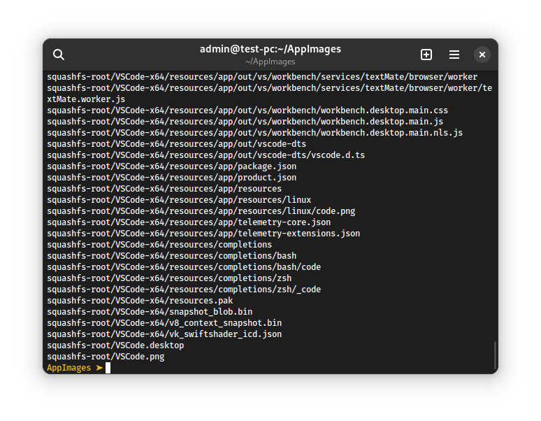

# Интеграция AppImage пакетов в систему

[TOC]

## Введение

AppImage — формат переносимых дистрибутиво-независимых пакетов программного обеспечения, работающий по принципу «один файл = один пакет». Файл AppImage-пакета является образом файловой системы squashfs, все данные откуда доступны только для чтения. Когда мы запускаем такой пакет, данные из него монтируются в систему (как правило, в каталог `/tmp`), после чего запускается BASH-скрипт `AppRun`, который, в свою очередь, запускает двоичный файл программы или другой скрипт, запакованный в AppImage.

Такие пакеты не устанавливаются в систему и никак в неё не интегрируются. Пользователь скачивает файл формата AppImage, даёт ему право исполнения и запускает.


<small>Свойства типичного AppImage пакета. Для того, чтобы его можно было использовать, файлу <pre>*.AppImage</pre> нужно дать право на исполнение.</small>

## Где удобно применять

Использование данного типа дистрибутиво-независимых пакетов оправдано в основном для небольшого и простого программного обеспечения, не предъявляющего особых требований по безопасности, доступу к определённым системным ресурсам и интеграции в пользовательское окружение.

AppImage пакеты рассматриваются в данном проекте из-за их небольшого размера, простого строения (структуру файлов в пакете см. в приложении), простоты сборки и небольших затрат как силы, так и времени на развёртывания такого типа пакетов в операционной системе.

---

## Интеграция пакетов в систему

Для начала требуется распаковать пакет. Для этого нужно открыть терминал и перейти в каталог с нужным нам AppImage пакетом. Предположим, что этот каталог — `~/AppImages`. Тогда команда для перехода в него будет такой:

```bash
cd ~/AppImages
```

После чего нужно получить доступ к двум файлам из пакета (логотип программы и `*.desktop` файл, который служит для интеграции в систему). Для этого запустите пакет, передав ему аргумент `--appimage-extract`. К примеру, есть пакет `VSC.AppImage`. Команда для него будет иметь следующий вид:

```bash
./VSC.AppImage --appimage-extract
```

В терминал будут выведены распакованные файлы:

 

Все файлы пакета будут распакованы в каталог `squashfs-root`:


<small>Примерное содержимое <code><pre>squashfs-root</pre></code>.</small>

- `AppRun` предназначен для запуска программы из пакета.
- `*.desktop` — это файл, который будет использован для интеграции в окружение пользователя. Он содержит параметры (имя, описание, логотип), которые потом будут отображены в главном меню системы в списке установленных приложений.
- `*.png` — логотип программы, используется в параметре `Icon` из файла `*.desktop`.
- `.DirIcon` — скрытый файл, который является ссылкой на `*.png`.
- Все остальные файлы относятся непосредственно к пакету(-ам).

Файл `*.desktop` нужно скопировать либо в `/usr/share/applications` (для копирования сюда требуются права пользователя `root`), либо в `~/.local/share/applications`. В параметре `Exec` нужно изменить путь до исполняемого файла: указать, где находится запускаемый пакет (в нашем случае это будет `/home/$USER/AppImages/VSC.AppImage`, где `$USER` — имя текущего пользователя).


Файл `*.png` нужно скопировать в каталог `/usr/share/icons/hicolor/R/apps`, где `R` - разрешение файла `*.png`, например, 256х256, 512х512 и т. д.
